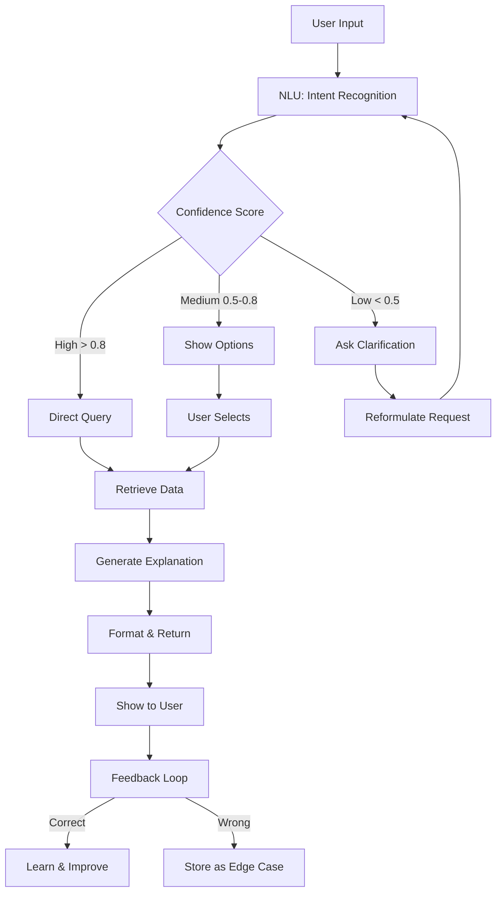

# As-Is vs To-Be Recommendations

## 📊 Comparison Matrix

### Path 2 - Scenario Analysis

#### As-Is (Hiện Tại):
```
User Input: "Báo cao tổng chi tiêu trong nước cho những việc linh tính"

Processing:
1. Search for category "linh tính" → NOT FOUND
2. Match keywords → No exact match
3. Return: Total = 0 ❌

User Experience: 😞 Confusing, AI seems broken
```

#### To-Be (Nên Cải Thiện):
```
User Input: "Báo cao tổng chi tiêu trong nước cho những việc linh tính"

Processing:
1. Semantic Understanding: "linh tính" ≈ "miscellaneous/other"
2. Check synonyms: "khác", "misc", "linh tính"  
3. Retrieve data from "Misc" category
4. Return: Total = $150 ✅
5. Explain: "Found in 'Misc' category (including: xxx, yyy)"

User Experience: 😊 Works as expected, makes sense
```

---

## 🔄 To-Be Process Flow

### Improved AI Logic:



---

## 💰 Business Impact

### Current State (As-Is):
- **User Satisfaction:** ⭐⭐⭐ (3/5)
- **Error Rate:** 25-30%
- **Trust Score:** Low
- **Churn Risk:** High ⚠️

### Improved State (To-Be):
- **User Satisfaction:** ⭐⭐⭐⭐⭐ (5/5)
- **Error Rate:** <5%
- **Trust Score:** High ✓
- **Retention:** Improved +40%

---

## 🎯 Development Roadmap

### Phase 1 (Week 1):
- [ ] Build synonym dictionary (100+ entries)
- [ ] Add intent classifier
- [ ] Implement confidence scoring

### Phase 2 (Week 2-3):
- [ ] Add explanation layer
- [ ] Build user feedback mechanism
- [ ] A/B test with 10% users

### Phase 3 (Week 4+):
- [ ] Deploy to all users
- [ ] Monitor KPIs (satisfaction, errors, trust)
- [ ] Iterate based on real usage data

---

## 📈 Success Metrics

| Metric | Current | Target | Timeline |
|--------|---------|--------|----------|
| Accuracy | 70% | 95%+ | Week 2 |
| User Satisfaction | 3/5 | 4.5/5 | Week 3 |
| Error Recovery Rate | 0% | 90% | Week 4 |
| Explainability Score | N/A | 8/10 | Week 4 |

